# 17_techstack_sre_devops

A compact Terraform-based AWS infrastructure project for provisioning a VPC and EC2 instance using a modular configuration.

A simple, reusable AWS deployment pattern for provisioning networking and compute resources with infrastructure as code.


| Area | Details |
| --- | --- |
| Region | `eu-west-2` |
| Primary goal | VPC + EC2 provisioning |
| Tooling | Terraform + AWS CLI |
| Pattern | Modular infrastructure as code |
| Provisioned resources | `1 VPC, 3 public subnets, 1 Internet Gateway, 1 public route table, 3 route-table associations, and 1 EC2 instance using the supplied AMI and existing ENI` |

**Featured technologies:** Terraform, AWS, IaC, modular design

### Repo at a glance
- **Purpose:** Provision a public-facing VPC and EC2 instance with reusable Terraform modules
- **Deployment target:** AWS `eu-west-2`
- **Versioning approach:** Git-tracked infrastructure code with provider version pinning
- **State management status:** Local Terraform state is used for this project

## Table of Contents
- [Overview](#overview)
- [Architecture](#architecture)
- [Project Structure](#project-structure)
- [Root Configuration](#root-configuration)
- [Modules](#modules)
  - [VPC module](#vpc-module)
  - [EC2 instance module](#ec2-instance-module)
- [Features](#features)
- [Terraform concepts](#terraform-concepts)
- [Prerequisites](#prerequisites)
- [Quick Start](#quick-start)
- [Terraform Notes](#terraform-notes)
- [AWS and IaC Context](#aws-and-iac-context)
- [Project status and next steps](#project-status-and-next-steps)

## Overview
This project demonstrates infrastructure as code using Terraform with a modular structure. It provisions:

- a VPC and multiple subnets across Availability Zones
- an Internet Gateway and public route table for internet-bound traffic
- an EC2 instance attached to an existing network interface
- reusable modules for core infrastructure components

> Architecture at a glance: modular Terraform root configuration orchestrates reusable VPC and EC2 modules for a repeatable AWS deployment model.

### Components, network and security views (conceptual)
<p align="center">
  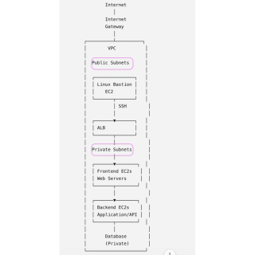
  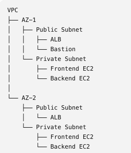
  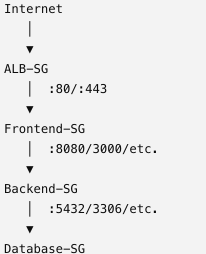
</p>


## Architecture

This project uses a public-facing VPC pattern for the AWS `eu-west-2` region. The VPC module creates the VPC, three public subnets, an Internet Gateway, and a shared public route table. The EC2 module creates one instance and attaches an existing ENI; the ENI must already belong to one of the intended public subnets.

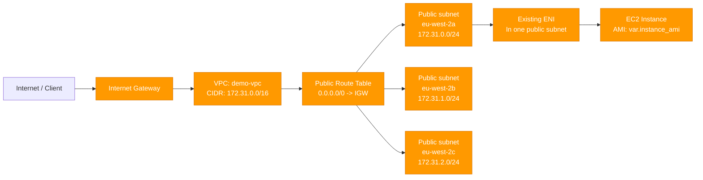

### Terraform resource mapping

The following mapping shows how each Terraform resource address corresponds to the public VPC architecture. The ENI is supplied as an existing AWS resource through `var.network_interface_id`; Terraform attaches it to the instance but does not create, move, or route it in this project.

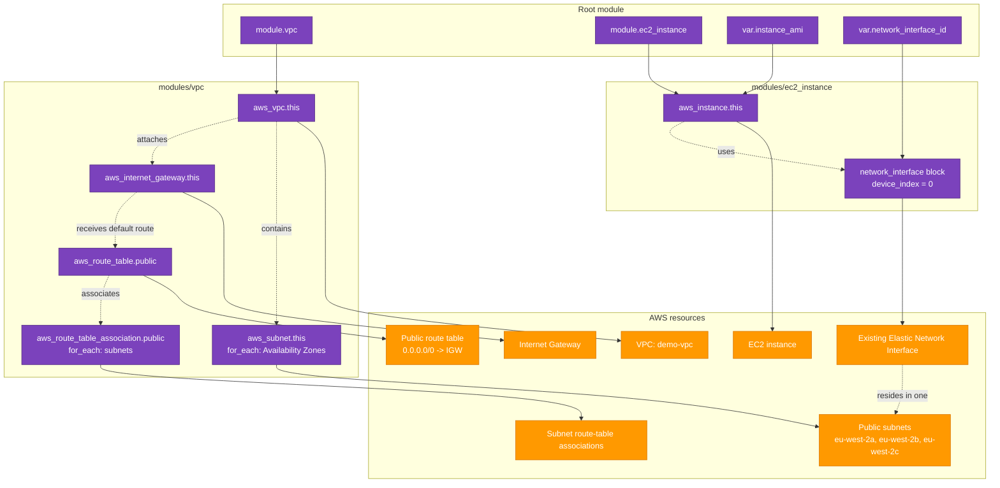

The environment is designed around a simple AWS networking model:

- VPC with a shared CIDR and subnet distribution across AZs
- public subnet routing through an Internet Gateway
- EC2 instance provisioning using a reusable module pattern
- provider configuration for the `eu-west-2` region


## Project Structure
```text
.
├── README.md
├── .gitignore
├── .terraform.lock.hcl
├── main.tf
├── variables.tf
├── settings.json               # local VS Code lint config
├── terraform.tfstate           # local-only; not committed - stores the workspace's state
├── terraform.tfstate.backup    # local-only; not committed - backup of the workspace's previous state 
├── terraform.tfvars.example
├── terraform.tfvars            # local-only; not committed
├── modules/
│   ├── vpc/
│   │   ├── main.tf
│   │   ├── variables.tf
│   │   └── outputs.tf
│   └── ec2_instance/
│       ├── main.tf
│       ├── variables.tf
│       └── outputs.tf
├── imgs/
└── .github/                    # optional for CI/CD setup
```
<p align="center">
  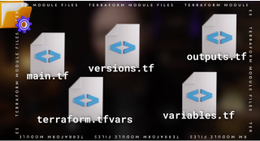
</p>

## Root Configuration

- `main.tf` contains the Terraform block and AWS provider configuration.
- `variables.tf` declares the root-level inputs passed into modules.
- `terraform.tfvars.example` safe template for local values.
- `terraform.tfvars` contains real values for my environment and excluded from version control.

<p align="center">
  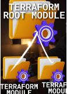
  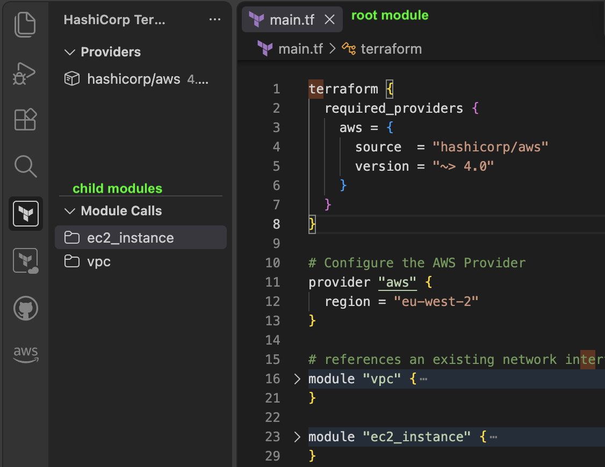
</p>

## Modules

### VPC module
The VPC module creates:

- the VPC resource
- one public subnet per configured Availability Zone
- an Internet Gateway attached to the VPC
- a public route table with a default route to the Internet Gateway
- one route-table association per subnet
- related tags and CIDR allocation logic

<p align="center">
  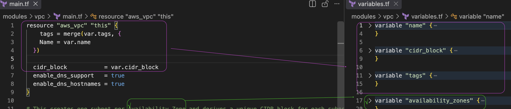
</p>

### EC2 instance module
The EC2 module creates an instance and connects it to a provided existing network interface. It does not create the ENI or its subnet.

<p align="center">
  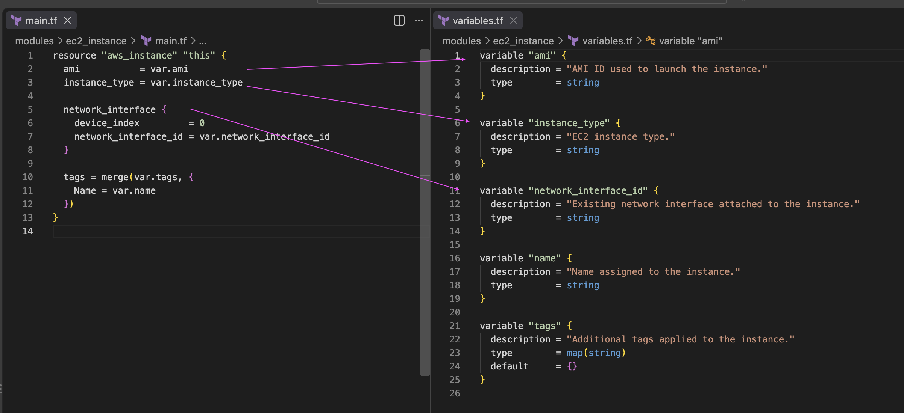
</p>

## Features

- Reusable public VPC module for network provisioning
- Reusable EC2 module for compute provisioning
- Internet Gateway and public route-table configuration
- Declarative Terraform configuration with environment-specific values in `terraform.tfvars`
- Provider version pinning for repeatable deployments
- Clean root-module structure suitable for extension and CI validation

## Terraform concepts

<p align="center">
  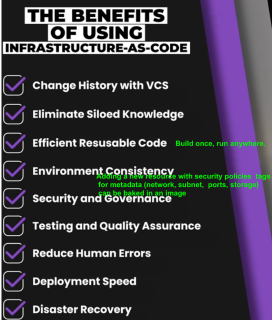
  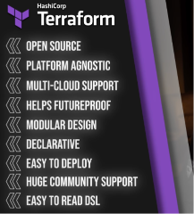
</p>

## Prerequisites

- Terraform installed locally in my local environment
- AWS CLI configured
- valid AWS credentials and region access
- an available AMI ID and ENI (attached to the EC2 instance) ID for my environment (please refer to `terraform.tfvars.example`)

<p align="center">
  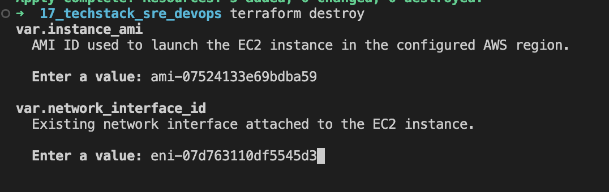
  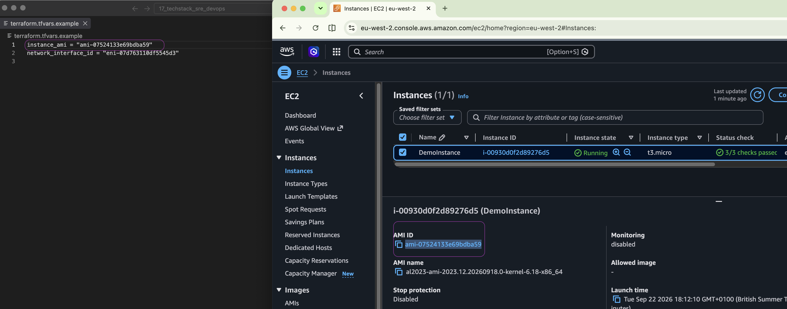
</p>

## Quick Start

- Copy the example values: `cp terraform.tfvars.example terraform.tfvars`
- Update the file with your real AWS values
- Initialize the working directory: `terraform init`
<p align="center">
  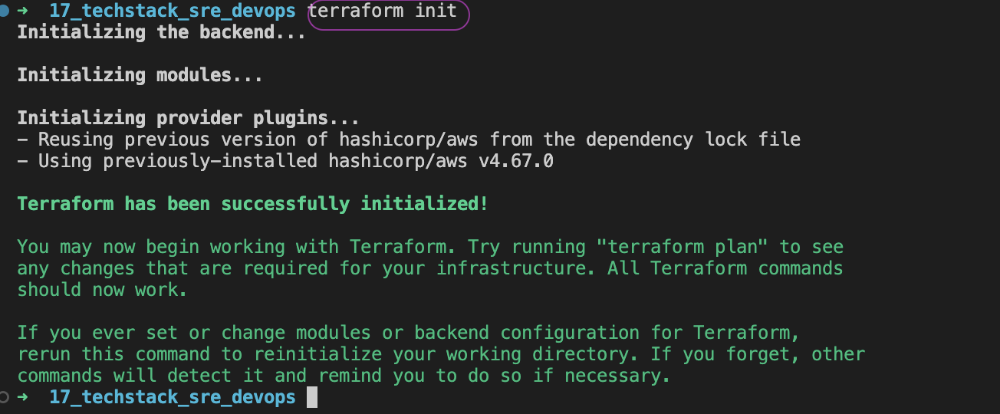
</p>
- Validate the configuration: `terraform validate`
<p align="center">
  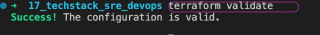
</p>
- Lint the configuration
<p align="center">
  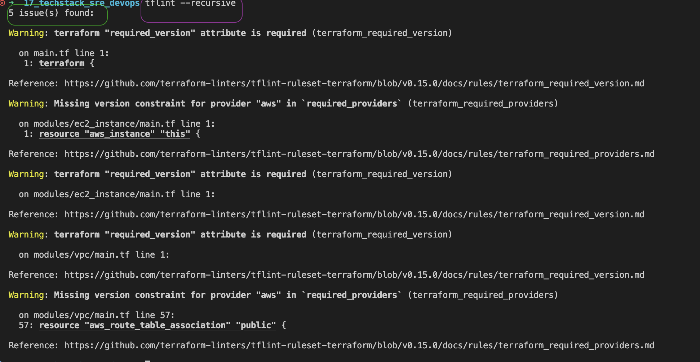
  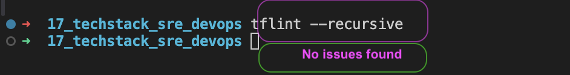
</p>
- Review changes: `terraform plan`
<p align="center">
  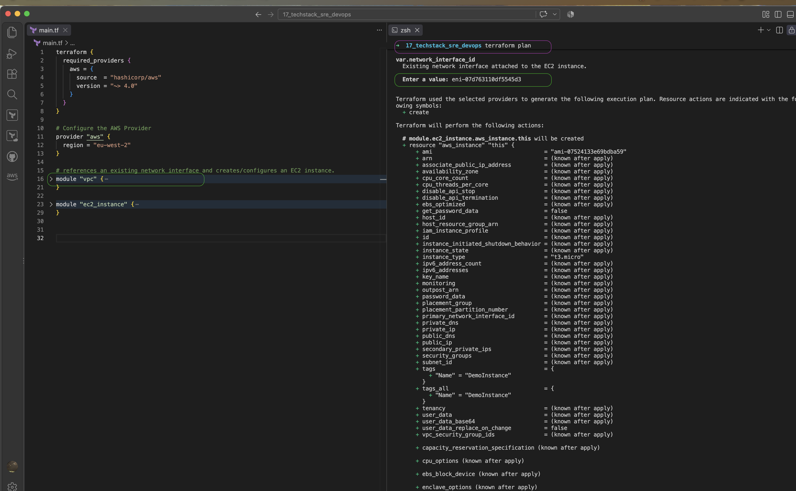
</p>
- Provision the environment: `terraform apply`
<p align="center">
  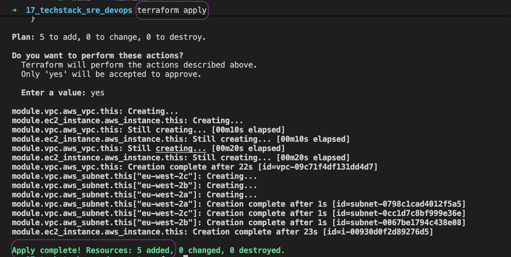
</p>
- Destroy the environment: `terraform destroy`
<p align="center">
  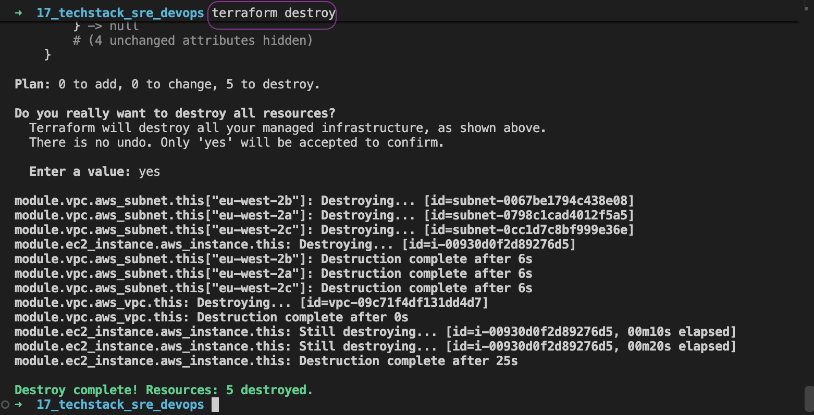
</p>

```bash
cp terraform.tfvars.example terraform.tfvars
# update terraform.tfvars with your real values

terraform fmt -recursive #main.tf
tflint --recursive
terraform init
terraform validate
terraform plan
terraform apply
# remove the resources when they are no longer needed
terraform destroy
```

## Terraform Notes

- The provider version constraint is already declared in `main.tf`.
- A separate `versions.tf` file is optional and not required for this project.
- Terraform is used in a declarative style, so the desired end state is defined in code and managed by the tool.
- Its lifecycle is `Write, Plan, Apply`

<p align="center">
  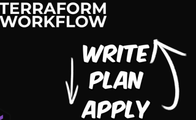
</p>

## AWS and IaC Context

### AWS initial operations

- Budget creation
- IAM setup
  - user: `alan`
  - group: `AlanAdministrators` with `AdministratorAccess`
- Alias creation and console access link: https://alandemo.signin.aws.amazon.com/console
- AWS CLI installation:
  `curl -fsSL https://awscli.amazonaws.com/v2/install.sh | bash`
- AWS profile configuration:
  `aws configure`

This project sits within a broader infrastructure-as-code practice that includes:

- infrastructure provisioning through declarative configuration
- modular reuse of networking and compute patterns
- version-controlled environment definitions
- repeatable cloud deployment workflows


## Project status and next steps

Status: validated Terraform configuration with a working module structure and AWS-compatible provider setup.

### Next steps
I will
1. Configure a Terraform backend for remote state management.
2. Add Security Groups to control inbound and outbound traffic.
3. Configure NAT Gateway support for private subnets.
4. Replace the existing EC2 instance with a Linux Bastion Host EC2 instance.
5. Add a Database resource to the infrastructure.
6. Extend the infrastructure with additional resources and supporting configuration.


