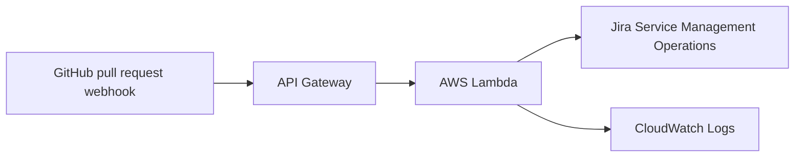

# PR Hotfix Alert Infrastructure

   

This Terraform configuration deploys the GitHub hotfix pull-request alert Lambda to AWS.

## Repo at a Glance

- **Purpose:** Detect GitHub pull requests from `hotfix` branches and create JSM Operations P1 alerts.
- **Runtime:** Node.js AWS Lambda
- **Infrastructure:** API Gateway, Lambda, S3 deployment package, IAM, and CloudWatch Logs
- **Alerting:** Jira Service Management Operations API
- **Region:** `eu-west-2`
- **Deployment package:** `nodejs-alert-deployment-package.zip`
- **Status:** Slack and AWS Secrets Manager integrations are disabled

## Project Structure

```text
pr-hotfix-alert/
├── hotfix-pr-alert-lambda/
│   ├── __tests__/hotfixAlert.test.js
│   ├── docs/images/flow.png
│   ├── events/
│   │   ├── github-ping-event.json
│   │   ├── hotfix-pr-event.json
│   │   └── non-hotfix-pr-event.json
│   ├── src/
│   │   ├── config.js
│   │   ├── handler.js
│   │   ├── services/jsmOperations.js
│   │   ├── services/slack.js
│   │   └── utils/event.js
│   ├── index.js
│   ├── package.json
│   └── package-lock.json
├── Terraform/
│   ├── module-aws/
│   │   ├── api_gateway.tf
│   │   ├── main.tf
│   │   └── variables.tf
│   ├── main.tf
│   ├── nodejs-alert-deployment-package.zip
│   ├── terraform.tfvars
│   └── terraform.tfvars.example
└── .gitignore
```

## Architecture



### Module Correspondence

| Terraform file | Responsibility |
| --- | --- |
| `main.tf` | Root provider, deployment inputs, and module composition |
| `module-aws/main.tf` | Lambda function, S3 package upload, IAM role and logging resources |
| `module-aws/api_gateway.tf` | API Gateway REST API, routes, Lambda integrations, stage, and invoke permission |
| `module-aws/variables.tf` | Reusable module inputs and defaults |
| `nodejs-alert-deployment-package.zip` | Lambda deployment artifact built from `hotfix-pr-alert-lambda/` |

The Lambda source maps to the runtime responsibilities as follows:

| Lambda file | Responsibility |
| --- | --- |
| `src/handler.js` | Validates GitHub webhook events and triggers JSM alerts |
| `src/utils/event.js` | Parses payloads and identifies hotfix branches |
| `src/services/jsmOperations.js` | Creates Jira Service Management Operations alerts |
| `src/config.js` | Loads JSM configuration from Lambda environment variables |

Terraform provisions:

- Lambda function `ps-alert`
- API Gateway REST API with root and proxy routes
- JSM Operations credentials passed as Lambda environment variables
- CloudWatch log group and IAM execution policies

Slack notifications and AWS Secrets Manager are disabled.

```bash
JSM_OPERATIONS_API_KEY=your-jsm-api-key
JSM_OPERATIONS_API_ENDPOINT=https://api.atlassian.com/jsm/ops/integration/v2/alerts
# Slack is disabled
```

Put real values in the ignored `terraform.tfvars` file. Use [terraform.tfvars.example](terraform.tfvars.example) as a template. Do not commit `terraform.tfvars` or Terraform state because both can contain credentials.

## Deployment

Run commands from this directory:

```bash
terraform init
terraform fmt
terraform validate
terraform plan
terraform apply
```

Required `terraform.tfvars` values:

```hcl
aws_access_key              = "your-aws-access-key"
aws_secret_key              = "your-aws-secret-key"
jsm_operations_api_key      = "your-jsm-api-key"
jsm_operations_api_endpoint = "https://api.atlassian.com/jsm/ops/integration/v2/alerts"
# slack_webhook_url            = "disabled"
```

The deployment package is built from `../hotfix-pr-alert-lambda` and stored as:

```text
nodejs-alert-deployment-package.zip
```

If the Lambda source changes, rebuild the package before applying:

```bash
rm -f nodejs-alert-deployment-package.zip
(cd ../hotfix-pr-alert-lambda && zip -qr ../Terraform/nodejs-alert-deployment-package.zip . -x 'docs/*' 'events/*' '__tests__/*' '*.DS_Store')
```

After deployment, Terraform outputs the API Gateway `base_url`. Configure that URL as the GitHub webhook endpoint and send `pull_request` events with the `X-GitHub-Event` header.

## Future SMS and Email AI Support

This can be added as a separate support flow without changing the GitHub hotfix alert flow:

```text
Email/SMS
    -> Amazon Connect
    -> Contact flow
    -> Lambda
    -> Amazon Bedrock
    -> AI response or human agent
```

Suggested implementation order:

1. Create an Amazon Connect instance.
2. Enable SMS and email channels.
3. Create one basic contact flow.
4. Add a Lambda function for incoming messages.
5. Connect the Lambda function to Amazon Bedrock.
6. Add human-agent fallback.
7. Add Terraform for Amazon Connect, Lambda, IAM, contact flows, and CloudWatch.
8. Test with one SMS number and one email address.

Start with Amazon Bedrock directly. Add Amazon Q in Connect later when dedicated agent-assistance features are needed.
