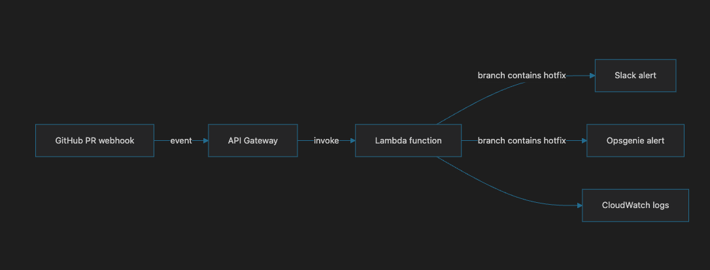
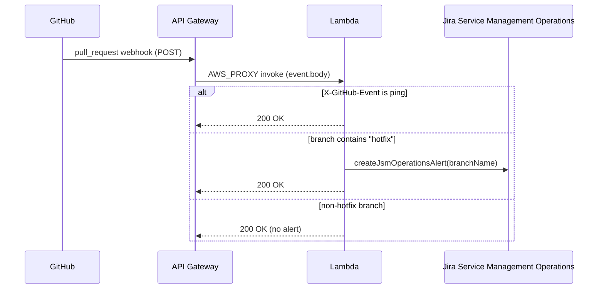

# Hotfix Pull Request Alerts

  

This project monitors GitHub pull request events and alerts for the **EE** teams when a pull request originates from a `hotfix` branch.

## Table of Contents

- [Overview](#overview)
- [Project structure](#project-structure)
- [Features](#features)
- [Technology](#technology)
- [Trigger](#trigger)
- [Flow diagram](#flow-diagram)
- [Secrets Manager configuration](#secrets-manager-configuration)
- [Local usage](#local-usage)
- [Main flow](#main-flow)

## Overview

This project listens for GitHub pull request webhooks, checks whether the source branch is a hotfix branch, and creates a P1 Jira Service Management Operations alert when appropriate. Slack notification code is currently disabled.

It has a modular structure so each concern is separated:

- event parsing and branch validation
- Lambda request handling
- Slack integration (disabled)
- Jira Service Management Operations integration
- environment configuration
- automated tests

## Project structure

```text
hotfix-pr-alert-lambda/
├── __tests__/
│   └── hotfixAlert.test.js
├── docs/
│   ├── images/
│   │   └── flow.png
├── events/
│   ├── github-ping-event.json
│   ├── hotfix-pr-event.json
│   └── non-hotfix-pr-event.json
├── src/
│   ├── config.js
│   ├── handler.js
│   ├── services/
│   │   ├── jsmOperations.js
│   │   └── slack.js
│   └── utils/
│       └── event.js
├── .gitignore
├── index.js
├── package.json
├── package-lock.json
├── README.md
└── node_modules/
```

## Features

- Detects GitHub ping requests and returns a successful response
- Reads the source branch from a pull request event
- Triggers alerts only when the branch name contains `hotfix`
- Slack webhook notification is currently disabled
- Creates a P1 Jira Service Management Operations alert for the hotfix PR
- Validates required environment variables before making external calls
- Includes unit tests for event parsing and alert decisions

## Technology

- Node.js
- AWS Lambda
- Axios
- GitHub webhooks
- Slack incoming webhooks
- Jira Service Management Operations API
- Jest

## Trigger

The Lambda is invoked by **API Gateway**, not directly by GitHub. Terraform provisions a REST API (see [Terraform/module-aws/api_gateway.tf](../Terraform/module-aws/api_gateway.tf)) with an `ANY` method on `/{proxy+}` and the root resource, using `AWS_PROXY` integration to the function, deployed to a `test` stage.

GitHub sends its pull request webhook to the API Gateway HTTPS endpoint (`base_url` output), API Gateway invokes the Lambda in proxy mode, and the raw HTTP request body arrives as a JSON string in `event.body`. The event type is identified via the `X-GitHub-Event` header (`ping` on webhook setup, `pull_request` for PR activity).

## Flow diagram





## Alert configuration

Terraform passes the JSM settings directly to the Lambda as environment variables:

```bash
JSM_OPERATIONS_API_KEY=your-jsm-api-key
JSM_OPERATIONS_API_ENDPOINT=https://api.atlassian.com/jsm/ops/integration/v2/alerts
# SLACK_WEBHOOK_URL is disabled
```

Keep these values in the ignored `Terraform/terraform.tfvars` file, not in the Lambda source.

## Local usage

Install dependencies:

```bash
npm install
```

Run tests:  

```bash
npm test
```

The Lambda entry point is configured in `index.js`, which forwards requests to the handler in `src/handler.js`.

## Test events

Sample AWS Lambda console test events are available under [`events/`](events):

- `hotfix-pr-event.json` — pull request from a `hotfix/*` branch, should trigger a Jira Service Management Operations alert
- `non-hotfix-pr-event.json` — pull request from a non-hotfix branch, should not trigger alerts
- `github-ping-event.json` — GitHub webhook ping request, should short-circuit with a 200 response

## Main flow

1. The Lambda receives a GitHub webhook payload.
2. It checks if the request is a `ping` event (via the `X-GitHub-Event` header).
3. It extracts the source branch from `pull_request.head.ref`.
4. If the branch includes `hotfix`, it creates a Jira Service Management Operations alert.
5. Otherwise, it exits without sending any alert.


